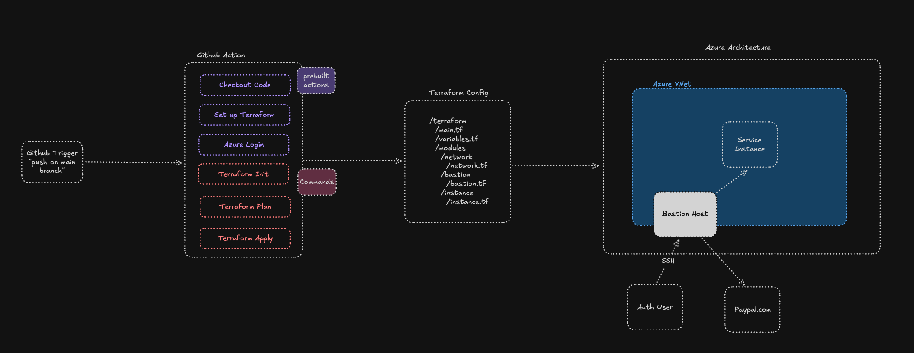

# Initial Requirements
## Architecture Diagram

## Requirements
- Build a Github Action CD pipeline that deploys that deploys modular Terraform code to Azure cloud
- The Terraform code should provision a new network and a bastion host in that network that can be SSH’d into. Only allow the bastion host to access [PayPal.com](http://PayPal.com), and no other internet connection.
- The Terraform code should also provision one more instance that can only be access by the Bastion host

## Testing
- Assure that all resource are provisioned with the terraform output command or the az resource list and check console
- try and make a http request to the bastion host, should fail
- ssh into the bastion host and try to make an http request to Paypal.com, should succeed
- trying to access any other site should fail
- ssh into the bastion host and then ssh into the second instance, should succeed
- ssh into a dummy bastion host in the same subnet and try to ssh into the second instance, should fail

# Expanded Requirements
## Dev Testing

## Improved Fault Tolerance and Scalability

## Special Release Workflow

## Expanded Requirements
- **Dev Testing** - we should have the option to boot up a test environment with 
less expensive and fault tolerance resources based Github PR Open events for feature branches so that devs
can test their changes before merging to main. On PR closed and merged events, we should also tear down the test infra.
- **Fault Tolerance and Scalability** - if our single instance of the bastion host or service goes down, were screwed.
We show increase availability by deploying to another Availability Zone (AZ) in the same region or another region.
We should also apply autoscaling (keeping in mind our subnet CIDR range) to prevent downtime from a potentially
overloaded instance receiving too much traffic. Who takes on this increased infra costs - assuming the customer?
- **Special Release Workflow** - on release label events, we should have a special workflow that runs higher coverage
validation, deploys the infra to production, and once successfully deployed, we should persists the change deployed so
we can audit and have for reference across customers.

## Final Thoughts
- If we want to be able to make terraform changes after the Github Actions completes,
how do we do that? The state file and plan file wont be persisted. Do we store the relevant files
in some type of storage like S3?